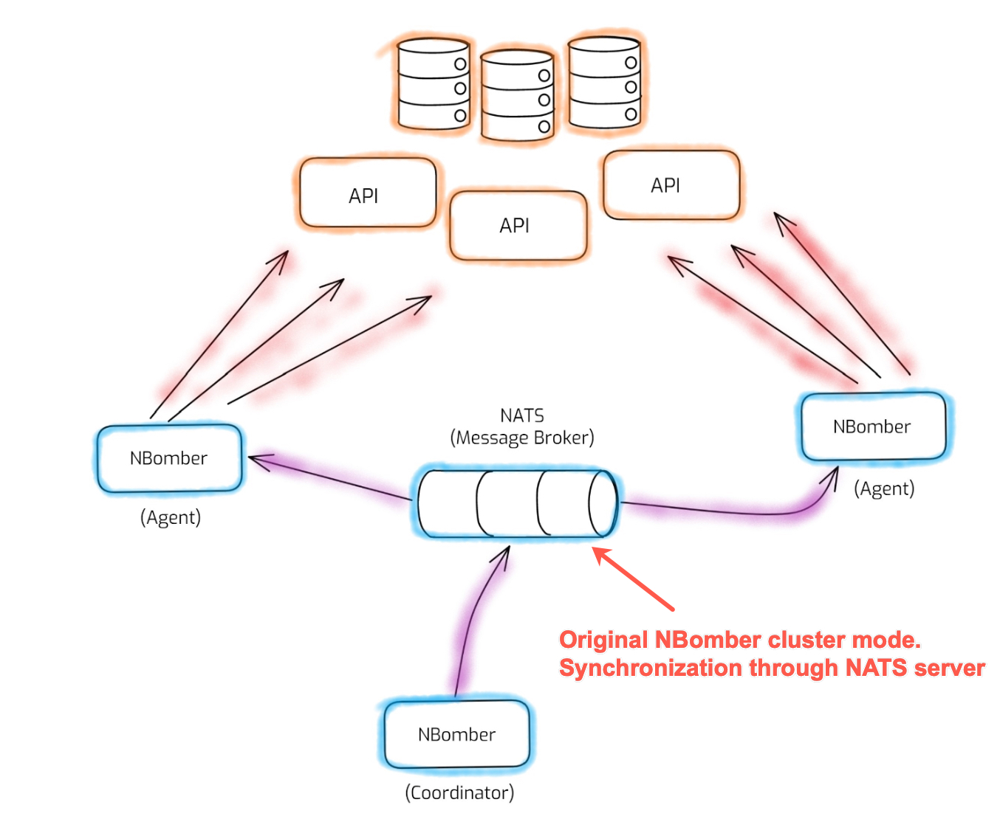
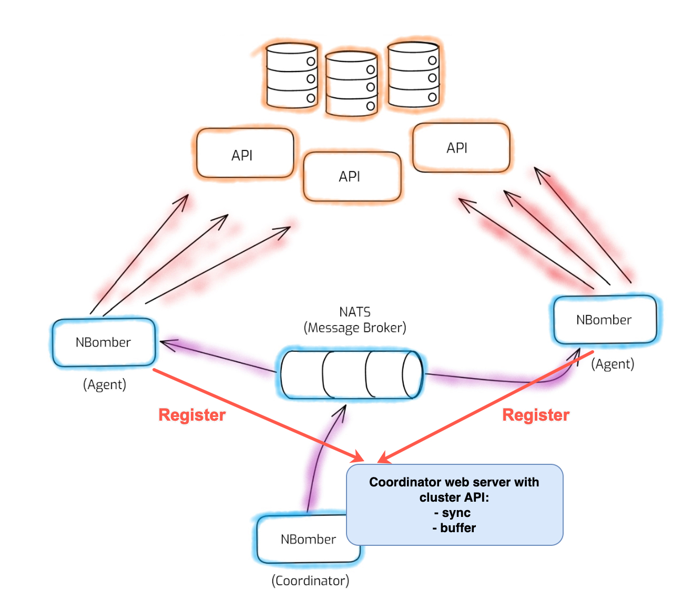

# GR8Tech.TestUtils.NBomberClusterFacade

Author: Mykola Panasiuk

Repository holds the source code for building the Nuget package **GR8Tech.TestUtils.NBomberClusterFacade**, which is responsible for:

- NBomber cluster synchronization before initializing NBomber runner
- Unified InfluxDBSink to store metrics in InfluxDB
- CustomClusterContext - key-value storage available for the whole cluster.

Original NBomber cluster mode:


NBomber cluster mode after integration with `GR8Tech.TestUtils.NBomberClusterFacade`:


## Settings for NBomber cluster 
Add `test-settings.json` or `appsettings.json` to your performance project. The required section in settings looks like an example below:

```json
{
  "ClusterSettings": {
    "NATSServerUrl": "nats://localhost",
    "CoordinatorHostUrl": "http://localhost:5777",
    "InfluxDB": {
      "Url": "http://localhost:8086",
      "DataBaseName": "nbomber_demo",
      "User": "admin",
      "Password": "admin"
    },
    "ReportingTags": {
      "CommonTags": {
        "test_name": "YourTestName",
        "pipeline": "unknown",
        "build_simpleWebApp": "unknown"
      },
      "AnnotationTags": {
        "pipeline": "unknown",
        "build_simpleWebApp": "unknown",
        "config_SimpleWebApp": "unknown"
      }
    },
    "License": null,
    "ClusterId": "my_test_cluster_1",
    "MinAgentsCount": 0,
    "RunnerSettings": {
      "Type": "coordinator",
      "AgentGroup": "group_1"
    },
    "CoordinatorScenarios": [
      "Scenario_LoadHttp",
      "Scenario_LoadKafka"
    ],
    "Agents": [
      {
        "AgentGroup": "group_1",
        "TargetScenarios": [
          "Scenario_LoadHttp",
          "Scenario_LoadKafka"
        ]
      }
    ]
  }
}
```

Some details and comments about settings for cluster mode:
- `NATSServerUrl`, `InfluxDB` - infrastructure
- `CoordinatorHostUrl` - NBomber coordinator creates a http server on `http://localhost:5777` in order to synchronize the cluster. It's can be done thanks to Nuget package `GR8Tech.TestUtils.NBomberClusterFacade`
- `ReportingTags__CommonTags` - REQUIRED minimum set of tags such as "pipeline", "test_name" and "build_YOUR-SERVICE-NAME" (prefix "build_" is required)
- `License` - can be null for localhost
- `ClusterId` - can be any for localhost, but not on CI
- `MinAgentsCount` - how many agents to wait for coordinator
- `RunnerSettings__Type` - coordinator or agent

## How to use
The minimum steps required for class Program.cs are:
- SynchronizeCluster
- AnnounceTheStartOfTheTest
- Initialize NBomberClusterRunner
- AnnounceTheEndOfTheTest
The rest steps are up to you. 

As a result your Program.cs should look like the example below:

```csharp
using GR8Tech.TestUtils.NBomberClusterFacade;
using GR8Tech.TestUtils.NBomberClusterFacade.Extensions;
using NBomber.Cluster.CSharp;
using Tests.Performance.Scenarios;
using Tests.Performance.Settings;

var settings = SettingsProvider.TestSettings;

// you may add additional annotation tags in the next way:
var annotationTags = NBomberClusterFacade.ClusterSettings.ReportingTags.AnnotationTags;
annotationTags.Add("kafkaUsers", settings.KafkaUsers.ToString());
annotationTags.Add("httpUsers", settings.HttpUsers.ToString());
annotationTags.Add("testDuration", settings.TestDurationSeconds.ToString());
annotationTags.Add("testRampUp", settings.RampUpSeconds.ToString());

await NBomberClusterFacade.SynchronizeCluster();
await NBomberClusterFacade.AnnounceTheStartOfTheTest();

NBomberClusterRunner
    .RegisterScenarios(ScenarioFactory.RegisteredScenarios)
    .WithTestName(NBomberClusterFacade.TestName)
    .WithReportingSinks(NBomberClusterFacade.InfluxDbSink)
    .WithReportingInterval(TimeSpan.FromSeconds(5))
    .WithLoggerConfig(() => NBomberClusterFacade.LoggerConfiguration)
    .LoadConfig(await NBomberClusterFacade.GetConfigFilePath())
    .GetRunDevOrCi(NBomberClusterFacade.ClusterSettings.License)
    .Run();

await NBomberClusterFacade.AnnounceTheEndOfTheTest();
```

### Develop and debug performance tests on the localhost
Before moving everything to CI make sure that:
- you developed your performance scenarios
- you run all the infrastructure and services under the test on your localhost
- you run and debug your performance tests on the localhost, including the cluster mode
  - tip: to run NBomber cluster you may simply run two runners from the terminal, example:
  
    ```shell
    export ClusterSettings__RunnerSettings__Type=coordinator; dotnet run
    export ClusterSettings__RunnerSettings__Type=agent; dotnet run
    ```
    